# 🏗️ Primescore Partner Portal — Full Architecture Reference

> Last updated: Aug 28, 2026

---

## 1. System Overview

The Primescore Partner Portal is a **Next.js 15 App Router** application backed by **Supabase** (PostgreSQL + Auth + Realtime). It serves three distinct user groups through separate route segments:

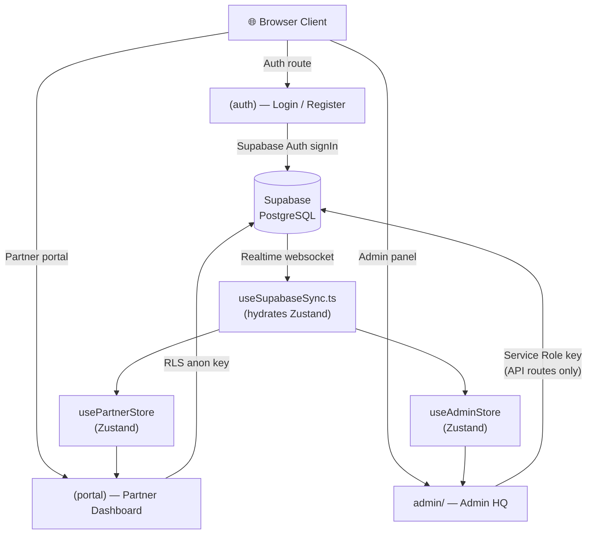

---

## 2. User Roles & Auth Flow

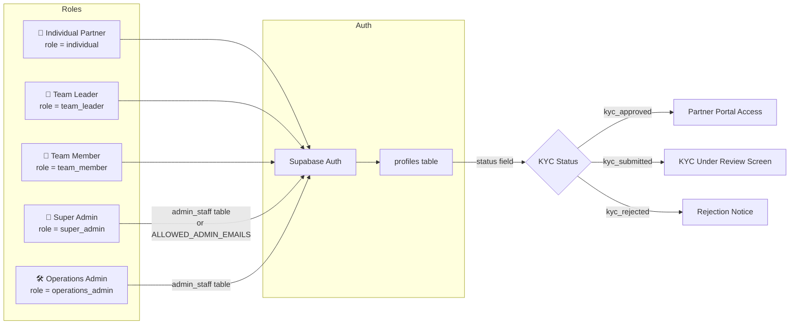

### Admin Login Flow (Multi-Fallback)

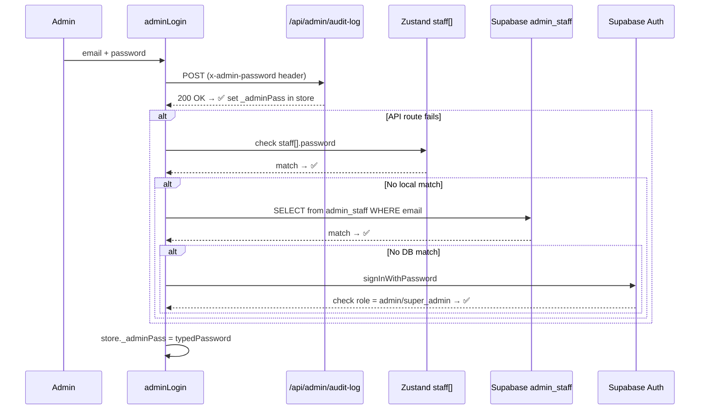

> **Security Note:** `ADMIN_PASSWORD` is a server-only env var (no `NEXT_PUBLIC_` prefix). The typed password is stored in-memory in `_adminPass` (Zustand, session-scoped, not persisted) and sent as `x-admin-password` header to API routes for authorization.

---

## 3. Feature Access Map

| Feature | Individual Partner | Team Leader | Team Member | Admin |
|---|---|---|---|---|
| Dashboard (overview metrics) | ✅ | ✅ | ✅ | ✅ (admin overview) |
| Submit Lead / Referral | ✅ | ✅ | ✅ | ➕ manual via ManualAddLeadModal |
| View own referral pipeline | ✅ | ✅ | ✅ | — |
| View team members' referrals | — | ✅ (team page) | — | ✅ (all teams) |
| Override points (10% team override) | — | Received automatically | — | Configurable |
| Redeem PrimePoints (gift cards) | ✅ | ✅ | ✅ | — |
| View PrimePoints & transactions | ✅ | ✅ | ✅ | ✅ per partner |
| Tier status & progress | ✅ (rewards page) | ✅ | ✅ | — |
| Referral QR code / share link | ✅ | ✅ | ✅ | — |
| KYC submission | ✅ | ✅ | ✅ | — |
| KYC approval/rejection | — | — | — | ✅ (kyc/[id]) |
| Lead pipeline progression | — | — | — | ✅ (referrals/[id]) |
| Manual issue points | — | — | — | ✅ (issueAdminPoints) |
| Send in-app notifications | — | — | — | ✅ (notifications) |
| Broadcast announcements | — | — | — | ✅ (broadcast) |
| Manage gift cards catalog | — | — | — | ✅ |
| Approve redemptions + issue vouchers | — | — | — | ✅ (gift-cards) |
| Reward engine config | — | — | — | ✅ (rewards-config) |
| Analytics dashboard | — | — | — | ✅ |
| Staff management | — | — | — | ✅ (super_admin only) |

---

## 4. Database Schema — Key Tables

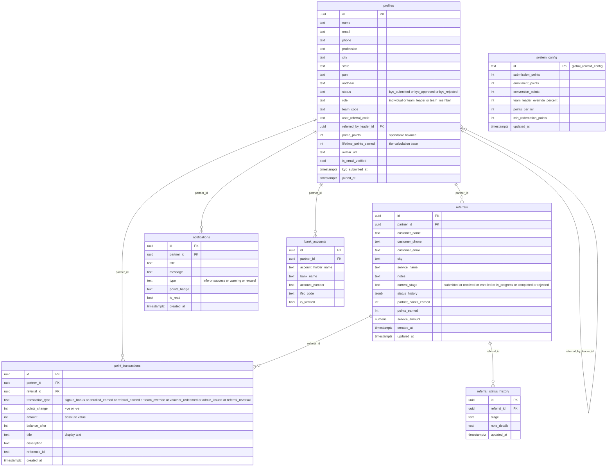

---

## 5. Points Economy — Full Flow

### 5.1 Where Points Come From

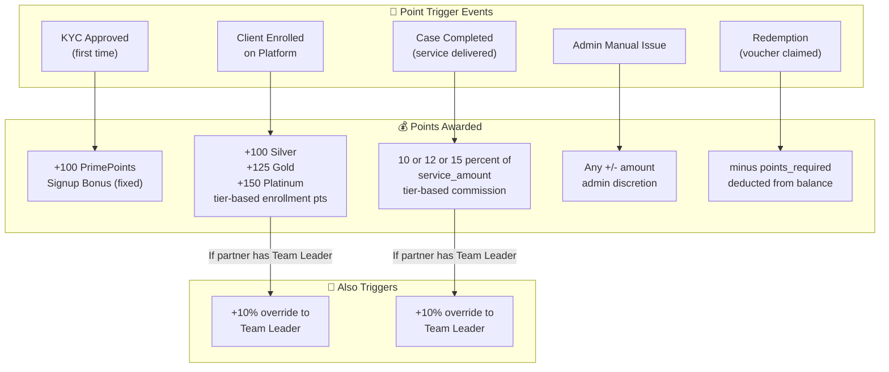

### 5.2 Points Calculation Logic

| Event | Formula | Who Triggers | File |
|---|---|---|---|
| KYC Approval | `+100` flat | Admin (approveKyc) | `lib/admin-store.ts` |
| Client Enrolled | `getReferredUserEnrollmentPoints(partnerTier)` → 100/125/150 | Admin (referrals/[id]) | `app/admin/referrals/[id]/page.tsx` |
| Case Completed | `round(serviceAmount × commissionRate / 100)` where rate = 10/12/15% | Admin (CompleteCaseModal) | `components/admin/CompleteCaseModal.tsx` |
| Team Override | `round(partnerPoints × 0.10)` | Auto on completion | `components/admin/CompleteCaseModal.tsx` |
| Admin Issued | Manual amount (+ or -) | Admin (issueAdminPoints) | `lib/admin-store.ts` |
| Voucher Redemption | `-(denomination × pointsPerInr)` | Partner (redeem page) | `app/(portal)/redeem/page.tsx` |

### 5.3 Tier Calculation

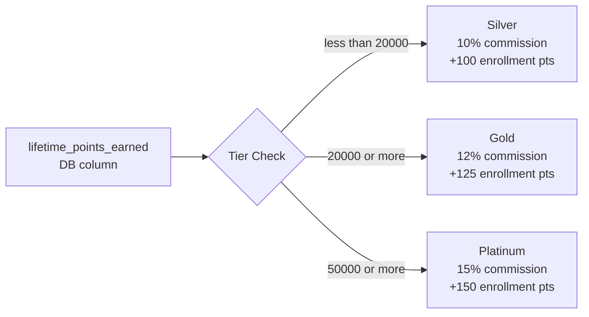

> **Key design:** `prime_points` is the spendable balance (goes down on redemption). `lifetime_points_earned` is the tier basis (never decreases). Both are columns in `profiles`. Tier uses lifetime so redemptions don't lower your tier.

---

## 6. Full Lead/Referral Pipeline

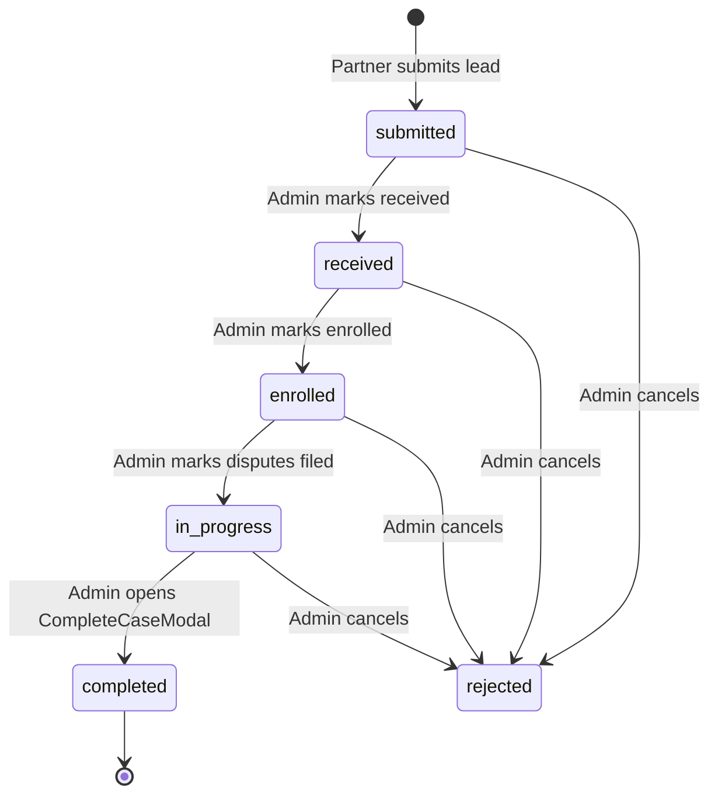

### Stage Transition — Who Does What

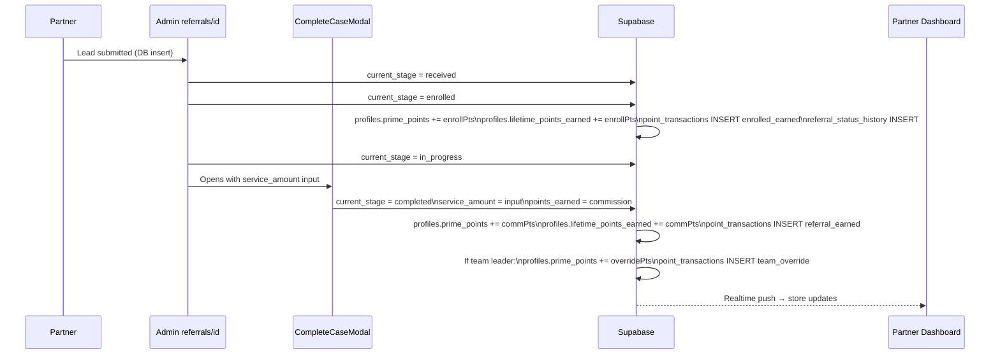

---

## 7. State Management Architecture

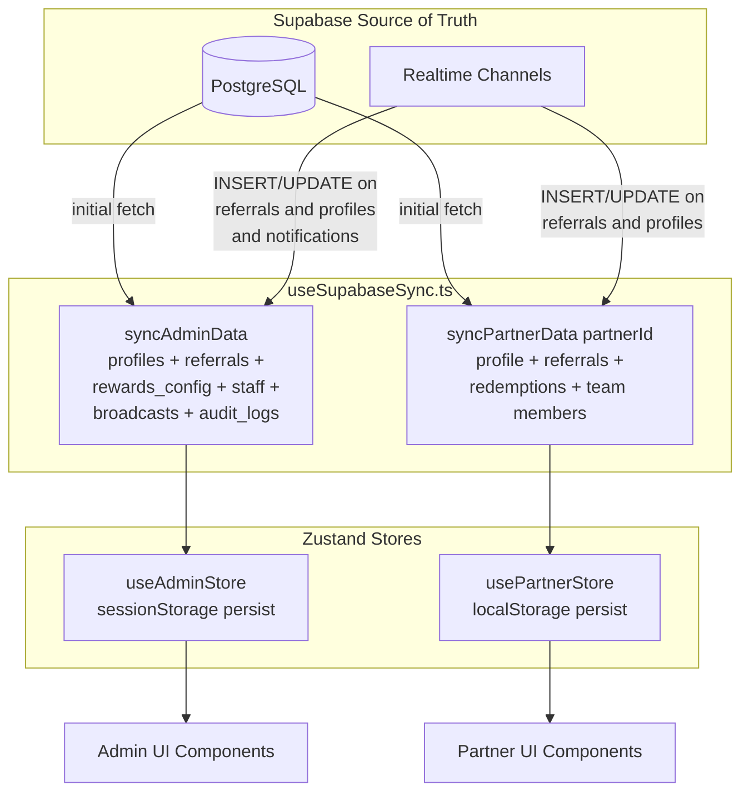

### Zustand Store Persistence

| Store | Storage | Key | Notes |
|---|---|---|---|
| `usePartnerStore` | `localStorage` | `primescore-partner-store-v10` | Persists login state across tabs |
| `useAdminStore` | `sessionStorage` | `primescore-admin-store-v7` | Cleared on tab close |
| `_adminPass` | In-memory only | — | Never written to storage |

---

## 8. API Routes — Security Model

All admin API routes validate `x-admin-password` header against the server-side `ADMIN_PASSWORD` env var:

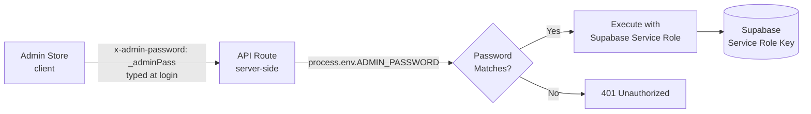

| Route | Method | Action |
|---|---|---|
| `/api/admin/audit-log` | POST | Insert audit log entry |
| `/api/admin/broadcast` | POST | Create broadcast announcement |
| `/api/admin/partners/create` | POST | Create partner in Supabase Auth + profiles |
| `/api/admin/partners/password` | POST | Reset partner Supabase Auth password |
| `/api/admin/partners/password` | DELETE | Delete partner from Supabase Auth |
| `/api/admin/send-notification` | POST | Insert notification for one or all partners |
| `/api/admin/staff` | POST/PUT/DELETE | Manage admin_staff table |
| `/api/email/send-otp` | POST | Send OTP email via Resend API |

---

## 9. KYC Approval Flow & Points

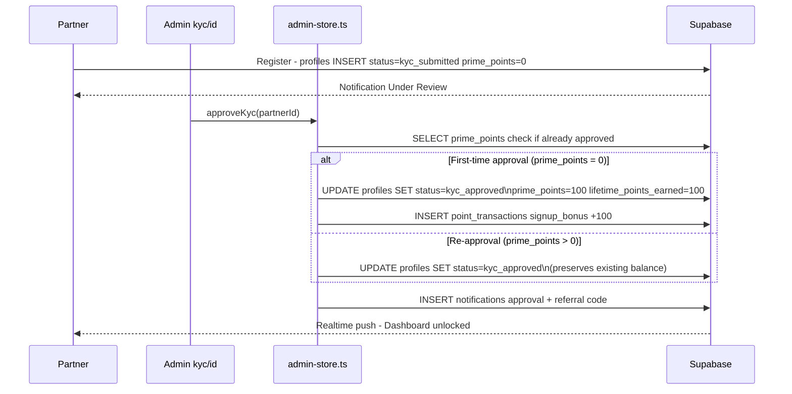

---

## 10. Gift Card Redemption Flow

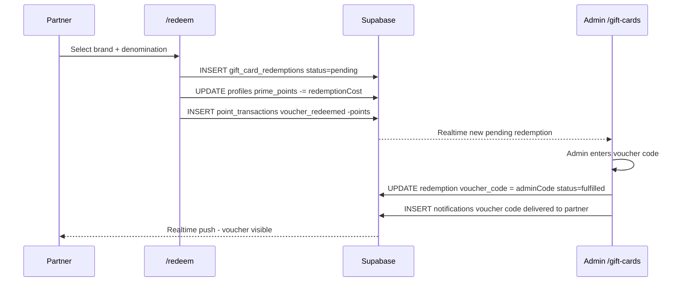

---

## 11. Team Leader Override Economy

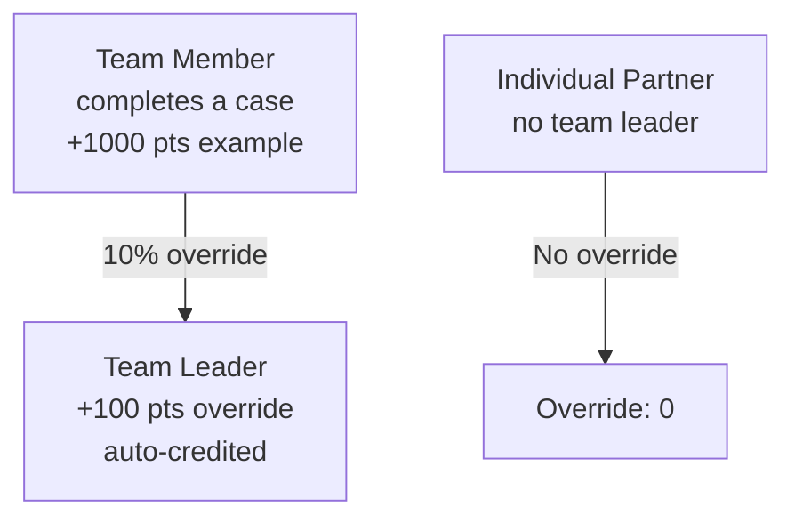

### Team Structure

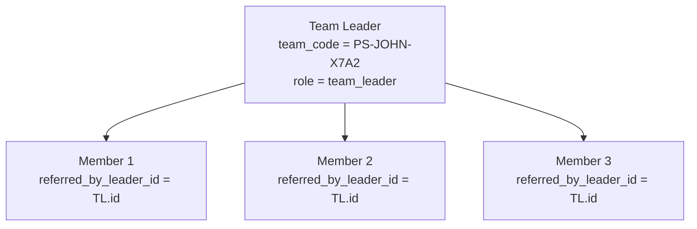

---

## 12. Notification System

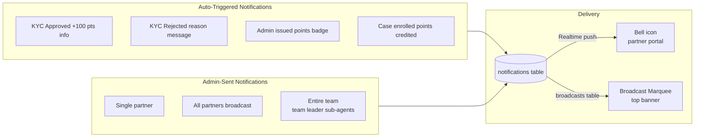

---

## 13. Rewards Config — Admin Control Panel

Admin can change all point values live from `/admin/rewards-config`. Changes write to `system_config` table and are read by:
- `useSupabaseSync.ts` → `useAdminStore.rewardConfig`
- Individual components before awarding points

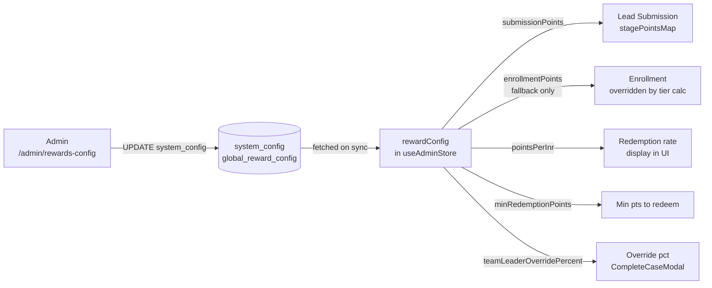

---

## 14. Complete File → Feature Map

| File/Route | Role | What it does |
|---|---|---|
| `app/(auth)/login` | All | Email+pass login → Supabase Auth |
| `app/(auth)/register` | All | Multi-step signup → Supabase Auth + profiles insert |
| `app/(portal)/dashboard` | Partner | Metrics, chart, tier progress, QR code, transactions |
| `app/(portal)/referrals` | Partner | View own leads, check status history |
| `app/(portal)/rewards` | Partner | PrimePoints balance, tier roadmap, transaction log |
| `app/(portal)/redeem` | Partner | Spend points on gift cards |
| `app/(portal)/refer` | Partner | Share referral link / QR code |
| `app/(portal)/team` | Team Leader | View sub-agents, their stats, override points received |
| `app/(portal)/kyc` | Partner | KYC status / ID card after approval |
| `app/admin` | Admin | Overview KPIs, quick actions |
| `app/admin/kyc/[id]` | Admin | Review partner KYC, approve/reject |
| `app/admin/referrals` | Admin | All leads list + filter |
| `app/admin/referrals/[id]` | Admin | Lead pipeline, stage transitions, enrollment points |
| `app/admin/teams` | Admin | Team structure view |
| `app/admin/analytics` | Admin | Point economy charts |
| `app/admin/gift-cards` | Admin | Approve redemptions, issue voucher codes |
| `app/admin/notifications` | Admin | Send notifications to partners |
| `app/admin/rewards-config` | Admin | Live point configuration |
| `app/admin/services` | Admin | Manage service catalog |
| `app/admin/settings` | Admin | Staff management, system settings |
| `lib/store.ts` | — | Partner Zustand store + tier/point calc functions |
| `lib/admin-store.ts` | — | Admin Zustand store + all admin actions |
| `lib/useSupabaseSync.ts` | — | Realtime sync + initial data hydration |
| `lib/supabase.ts` | — | Supabase client + type definitions |
| `components/admin/CompleteCaseModal.tsx` | Admin | Case completion → commission pts + team override |
| `components/admin/ManualAddLeadModal.tsx` | Admin | Manually add lead on behalf of partner |
| `components/ui/LeadSubmittedRewardModal.tsx` | Partner | Popup after lead submit showing potential rewards |

---

## 15. Points Ledger — Transaction Types Reference

| `transaction_type` | Who Creates It | Points Direction | Trigger |
|---|---|---|---|
| `signup_bonus` | `approveKyc` | `+100` | First KYC approval |
| `enrolled_earned` | `referrals/[id]` inline | `+100/125/150` | Admin marks enrolled |
| `referral_earned` | `CompleteCaseModal` | `+(service_amount × rate%)` | Admin marks completed |
| `team_override` | `CompleteCaseModal` | `+(10% of commission)` | Auto on completion if team exists |
| `admin_issued` | `issueAdminPoints` | `+/- any` | Admin manual adjustment |
| `voucher_redeemed` | `redeem/page.tsx` | `-points_required` | Partner redeems gift card |
| `referral_reversal` | `deleteReferral` | `-(original pts)` | Admin cancels lead with reversal |

---

## 16. Points Update — Complete DB Write Sequence

Every points credit follows this exact pattern:

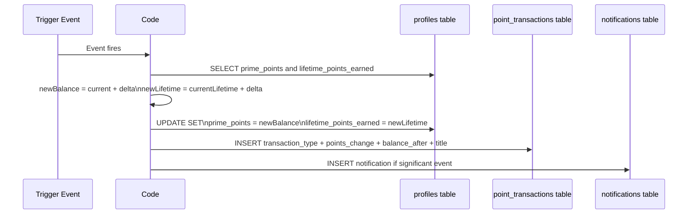

> **Rule:** Every balance change = one `point_transactions` row. Never modify `prime_points` without also updating `lifetime_points_earned`. Tier is calculated from `lifetime_points_earned` only — it never drops on redemption.
