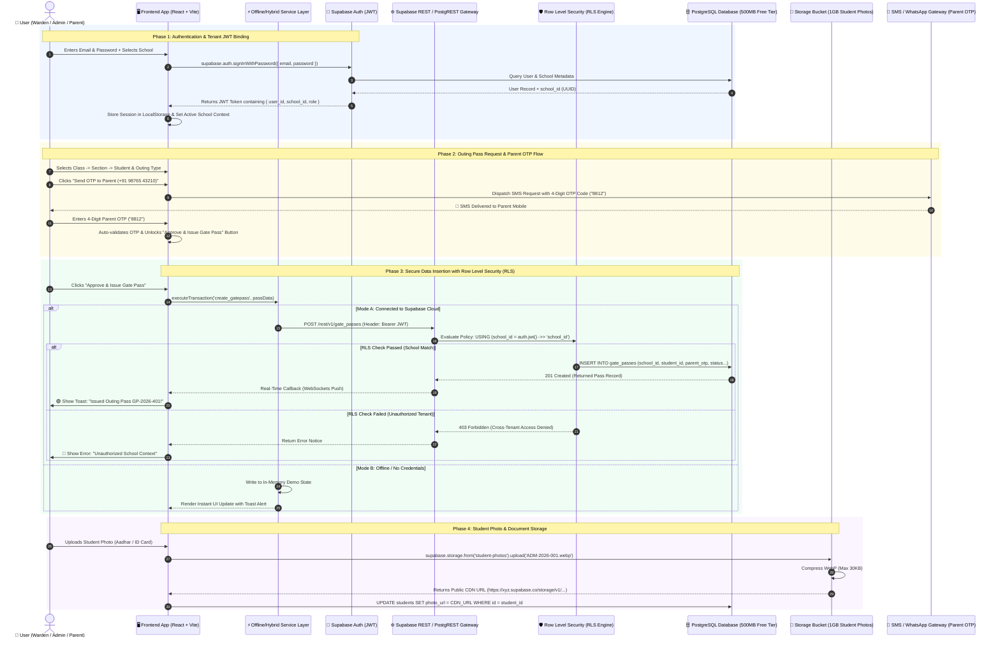

# Complete System Architecture & Multi-Tenant Database Plan

This document contains the complete, detailed **Database ERD Architecture** and the **End-to-End Request & Authentication Data Flow** for **Dettroin ERP** powered by Supabase.

---

## 📐 1. Full Detailed Database Architecture (Mermaid ERD)

This entity-relationship diagram maps out all 11 core ERP modules, showing tables, primary keys (`PK`), foreign keys (`FK`), indexes, and relationships. Multi-tenancy is enforced on every table via `school_id`.

```mermaid
erDiagram
    %% ==========================================
    %% MULTI-TENANCY & AUTHENTICATION
    %% ==========================================
    SCHOOLS {
        uuid id PK
        string school_name
        string school_code
        string affiliation_board
        string phone
        string email
        string logo_url
        timestamp created_at
    }

    USERS {
        uuid id PK
        uuid school_id FK
        string auth_uid FK
        string email
        string full_name
        string role "Admin | Principal | Teacher | Accountant | Warden | Parent"
        string phone
        boolean is_active
        timestamp last_login
    }

    ROLE_PERMISSIONS {
        uuid id PK
        uuid school_id FK
        string role_name
        text_array permissions "allowed subview keys"
    }

    %% ==========================================
    %% ACADEMIC & CLASS CONFIGURATION
    %% ==========================================
    ACADEMIC_SESSIONS {
        uuid id PK
        uuid school_id FK
        string session_code "2026-2027"
        date start_date
        date end_date
        boolean is_current
    }

    CLASSES {
        uuid id PK
        uuid school_id FK
        string class_code "CLS-10"
        string class_name "Class 10"
        string stream "Science | Commerce | Arts"
        integer capacity
    }

    SECTIONS {
        uuid id PK
        uuid class_id FK
        string section_name "Section A"
        string room_no
        integer capacity
    }

    SUBJECTS {
        uuid id PK
        uuid school_id FK
        string subject_code "SUB-MTH"
        string subject_name "Mathematics"
        string subject_type "Theory | Practical | Both"
        integer credit_hours
    }

    %% ==========================================
    %% STUDENT MASTER & PROFILE
    %% ==========================================
    STUDENTS {
        uuid id PK
        uuid school_id FK
        uuid class_id FK
        uuid section_id FK
        string admission_no PK
        string roll_no
        string full_name
        string gender
        date dob
        string blood_group
        string category "General | OBC | SC | ST"
        string caste
        string religion
        string house_name
        string aadhar_no "12-digit 4-4-4 block"
        string parent_name
        string parent_phone
        string parent_email
        text address
        string photo_url
        string status "Active | Inactive | Alumni"
    }

    %% ==========================================
    %% HR & FACULTY MANAGEMENT
    %% ==========================================
    STAFF_MEMBERS {
        uuid id PK
        uuid school_id FK
        string emp_id
        string full_name
        string department
        string designation
        string phone
        string email
        decimal basic_salary
        string bank_account_no
        string ifsc_code
        string status "Active | On Leave | Resigned"
    }

    ATTENDANCE_LOGS {
        uuid id PK
        uuid school_id FK
        uuid student_id FK
        date attendance_date
        string status "Present | Absent | Late | Leave"
        string marked_by
    }

    PAYROLL_RECORDS {
        uuid id PK
        uuid school_id FK
        uuid staff_id FK
        string month_year "August 2026"
        decimal net_salary
        decimal deductions
        string payment_status "Paid | Pending"
        date payment_date
    }

    %% ==========================================
    %% FEE MANAGEMENT & LEDGER
    %% ==========================================
    FEE_STRUCTURES {
        uuid id PK
        uuid school_id FK
        uuid class_id FK
        string fee_head "Tuition Fee | Computer Fee"
        decimal amount
        string frequency "Monthly | Quarterly | Annual"
    }

    FEE_PAYMENTS {
        uuid id PK
        uuid school_id FK
        uuid student_id FK
        string invoice_no
        decimal amount_paid
        decimal discount
        decimal fine_amount
        string payment_mode "UPI | Cash | NetBanking | Cheque"
        string transaction_ref
        date payment_date
        string status "Paid | Partial | Pending"
    }

    %% ==========================================
    %% RESIDENTIAL CAMPUS & HOSTEL MODULE
    %% ==========================================
    HOSTEL_BLOCKS {
        uuid id PK
        uuid school_id FK
        string block_name "Boys Block A (Senior)"
        string wing_type "AC | Non-AC"
        string warden_name
        string warden_phone
        integer total_rooms
    }

    HOSTEL_ROOMS {
        uuid id PK
        uuid block_id FK
        string room_no "B-101"
        string floor "1st Floor"
        string room_type "2-Seater | 3-Seater | 4-Dorm"
        integer total_beds
        integer occupied_beds
        decimal term_fee
        string sub_meter_id
        integer current_kwh_reading
    }

    HOSTEL_ALLOCATIONS {
        uuid id PK
        uuid school_id FK
        uuid room_id FK
        uuid student_id FK
        string bed_slot "Bed A (Window)"
        date allotment_date
        string billing_cycle "Monthly | Quarterly | Annual"
        string local_guardian_name
        string local_guardian_phone
        string escort_names
        string diet_type "Pure Veg | Non-Veg | Jain"
        string allergies
        string status "Active | Vacated"
    }

    GATE_PASSES {
        uuid id PK
        uuid school_id FK
        uuid student_id FK
        string pass_no "GP-2026-401"
        string outing_type "Weekend Home Leave | Medical | Custom"
        string custom_outing_reason
        string destination_reason
        timestamp departure_time
        timestamp return_time
        string parent_phone
        string parent_otp "4-digit code"
        boolean is_otp_verified
        string warden_signature_status "Approved | Pending"
        string gate_status "Checked Out | Returned | Pending"
    }

    NIGHT_ROLL_CALLS {
        uuid id PK
        uuid school_id FK
        uuid student_id FK
        uuid room_id FK
        date roll_call_date
        time check_time
        string status "Present in Room | Study Hall | Approved Leave | Unexcused Absent"
        boolean sms_alert_sent
    }

    HOSTEL_VISITORS {
        uuid id PK
        uuid school_id FK
        uuid student_id FK
        string pass_no "HVP-8801"
        string visitor_name
        string relationship
        string phone
        string purpose
        date visit_date
        string time_slot
        string status "Scheduled | Completed | Cancelled"
    }

    %% ==========================================
    %% LIBRARY MODULE
    %% ==========================================
    BOOK_CATALOG {
        uuid id PK
        uuid school_id FK
        string accession_no PK
        string isbn
        string title
        string author
        string publisher
        string category
        string rack_number
        integer total_copies
        integer available_copies
    }

    BOOK_ISSUES {
        uuid id PK
        uuid school_id FK
        string accession_no FK
        uuid borrower_student_id FK
        uuid borrower_staff_id FK
        string borrower_type "Student | Faculty"
        date issue_date
        date due_date
        date return_date
        decimal fine_amount
        string status "Active | Returned | Overdue"
    }

    %% ==========================================
    %% TRANSPORT & FRONT OFFICE
    %% ==========================================
    TRANSPORT_ROUTES {
        uuid id PK
        uuid school_id FK
        string route_code "RT-01"
        string route_name "South Delhi Ring Road"
        string vehicle_no "DL-1C-A-1082"
        string driver_name
        string driver_phone
        decimal monthly_fee
    }

    FRONT_OFFICE_VISITORS {
        uuid id PK
        uuid school_id FK
        string visitor_pass_no
        string visitor_name
        string phone
        string role_target "Student | Staff"
        string target_class_dept
        string purpose
        timestamp check_in
        timestamp check_out
    }

    %% ==========================================
    %% RELATIONSHIP MAPPINGS
    %% ==========================================
    SCHOOLS ||--o{ USERS : "has"
    SCHOOLS ||--o{ ROLE_PERMISSIONS : "configures"
    SCHOOLS ||--o{ CLASSES : "owns"
    SCHOOLS ||--o{ STUDENTS : "enrolls"
    SCHOOLS ||--o{ STAFF_MEMBERS : "employs"
    SCHOOLS ||--o{ HOSTEL_BLOCKS : "manages"
    SCHOOLS ||--o{ TRANSPORT_ROUTES : "operates"

    CLASSES ||--o{ SECTIONS : "contains"
    CLASSES ||--o{ STUDENTS : "places"
    SECTIONS ||--o{ STUDENTS : "groups"

    STUDENTS ||--o{ ATTENDANCE_LOGS : "records"
    STUDENTS ||--o{ FEE_PAYMENTS : "pays"
    STUDENTS ||--o{ HOSTEL_ALLOCATIONS : "occupies"
    STUDENTS ||--o{ GATE_PASSES : "requests"
    STUDENTS ||--o{ NIGHT_ROLL_CALLS : "checked_in"
    STUDENTS ||--o{ HOSTEL_VISITORS : "visited_by"
    STUDENTS ||--o{ BOOK_ISSUES : "borrows"

    STAFF_MEMBERS ||--o{ PAYROLL_RECORDS : "receives"
    HOSTEL_BLOCKS ||--o{ HOSTEL_ROOMS : "houses"
    HOSTEL_ROOMS ||--o{ HOSTEL_ALLOCATIONS : "allocates_bed"
    BOOK_CATALOG ||--o{ BOOK_ISSUES : "issued_as"
```



---

## 🔄 2. End-to-End Request, Auth & Multi-Tenant Data Flow Architecture

This sequence diagram illustrates how a user request (e.g. issuing a Gate Pass with Parent OTP or Allotting a Bed) flows through the entire system: **Frontend Client ➔ JWT Authentication ➔ Supabase API Gateway ➔ Row Level Security (RLS) Engine ➔ PostgreSQL Database ➔ Storage Bucket / SMS Notification Service**.



---

## 🔐 3. Supabase Row Level Security (RLS) SQL Script

Below is the production-ready SQL script to create multi-tenant tables and policies on Supabase. Execute this in your Supabase **SQL Editor**:

```sql
-- 1. ENABLE UUID EXTENSION
CREATE EXTENSION IF NOT EXISTS "uuid-ossp";

-- 2. CREATE SCHOOLS MASTER TABLE
CREATE TABLE public.schools (
    id UUID PRIMARY KEY DEFAULT uuid_generate_v4(),
    school_name TEXT NOT NULL,
    school_code TEXT UNIQUE NOT NULL,
    affiliation TEXT DEFAULT 'CBSE',
    phone TEXT,
    email TEXT,
    created_at TIMESTAMP WITH TIME ZONE DEFAULT NOW()
);

-- 3. CREATE STUDENTS TABLE WITH SCHOOL_ID TENANT FK
CREATE TABLE public.students (
    id UUID PRIMARY KEY DEFAULT uuid_generate_v4(),
    school_id UUID NOT NULL REFERENCES public.schools(id) ON DELETE CASCADE,
    admission_no TEXT NOT NULL,
    full_name TEXT NOT NULL,
    class_name TEXT NOT NULL,
    section_name TEXT NOT NULL,
    gender TEXT CHECK (gender IN ('Male', 'Female')),
    parent_phone TEXT NOT NULL,
    aadhar_no TEXT,
    photo_url TEXT,
    status TEXT DEFAULT 'Active',
    created_at TIMESTAMP WITH TIME ZONE DEFAULT NOW(),
    CONSTRAINT unique_adm_per_school UNIQUE (school_id, admission_no)
);

-- 4. ENABLE ROW LEVEL SECURITY (RLS)
ALTER TABLE public.schools ENABLE ROW LEVEL SECURITY;
ALTER TABLE public.students ENABLE ROW LEVEL SECURITY;

-- 5. RLS POLICY FOR STUDENTS (MULTI-TENANT ISOLATION)
CREATE POLICY "Strict School Tenant Access on Students"
ON public.students
FOR ALL
USING (
    school_id = (auth.jwt() ->> 'school_id')::uuid
    OR (auth.jwt() ->> 'role') = 'SuperAdmin'
);

-- 6. CREATE GATE PASSES TABLE WITH OTP VERIFICATION
CREATE TABLE public.gate_passes (
    id UUID PRIMARY KEY DEFAULT uuid_generate_v4(),
    school_id UUID NOT NULL REFERENCES public.schools(id) ON DELETE CASCADE,
    student_id UUID NOT NULL REFERENCES public.students(id) ON DELETE CASCADE,
    pass_no TEXT NOT NULL,
    outing_type TEXT NOT NULL,
    custom_outing_reason TEXT,
    destination_reason TEXT NOT NULL,
    departure_time TIMESTAMP WITH TIME ZONE NOT NULL,
    return_time TIMESTAMP WITH TIME ZONE NOT NULL,
    parent_phone TEXT NOT NULL,
    parent_otp TEXT NOT NULL,
    is_otp_verified BOOLEAN DEFAULT FALSE,
    gate_status TEXT DEFAULT 'Pending',
    created_at TIMESTAMP WITH TIME ZONE DEFAULT NOW()
);

ALTER TABLE public.gate_passes ENABLE ROW LEVEL SECURITY;

CREATE POLICY "Strict Tenant Access on Gate Passes"
ON public.gate_passes
FOR ALL
USING (school_id = (auth.jwt() ->> 'school_id')::uuid);
```

---

## 🧪 Verification & Execution Next Steps

1. **Review Architecture**: Check the database schema entities and request sequence flow above.
2. **Execute SQL Script**: Copy the SQL block above and paste it into your Supabase Dashboard ➔ **SQL Editor** ➔ Click **Run**.
3. **Connect Frontend**: Add your Supabase credentials to `frontend/.env`:
   ```env
   VITE_SUPABASE_URL=https://your-supabase-project.supabase.co
   VITE_SUPABASE_ANON_KEY=your-anon-key-here
   ```
