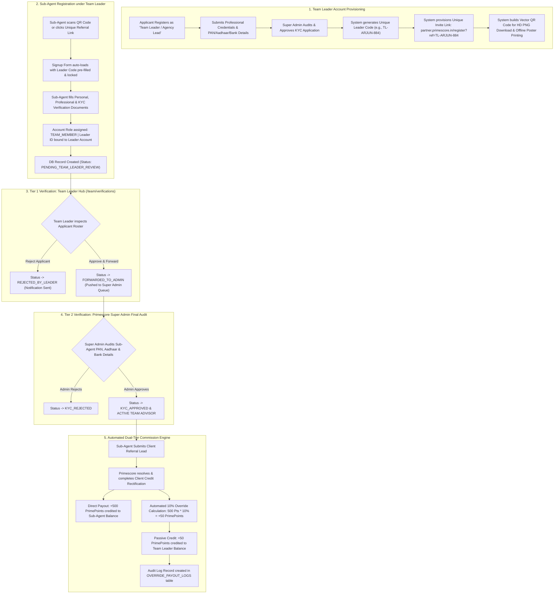
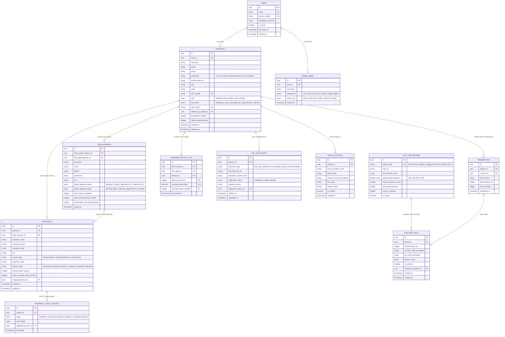

# PrimeScore Partner Network — Comprehensive Enterprise System Architecture & Workflows

This document outlines the end-to-end operational architecture, state transition engines, verification audit flows, commission calculations, and the complete multi-schema PostgreSQL database model powering the **PrimeScore Partner Portal**.

---

## 1. Individual Partner Registration, Document Verification & Lead Reward Lifecycle

```mermaid
flowchart TD
    subgraph PartnerOnboarding ["1. Partner Registration & Profile Creation"]
        A["Visitor opens Registration Form (/register)"] --> B["Select 'Individual Partner' Account Type"]
        B --> C["Enter Personal Details: Full Name, Email, Phone, Profession, City, State"]
        C --> D["Upload Profile Picture (Passport Headshot JPG/PNG)"]
        D --> E["Upload Verification Documents: PAN Card PDF/Image, Aadhaar Number/PDF"]
        E --> F["Enter Bank Details: Bank Name, Account Number, IFSC Code, Account Holder Name"]
        F --> G["Accept Digital Partner Network T&C Agreement"]
        G --> H["Submit Application -> DB Record Created (Status: PENDING_KYC_SUBMITTED)"]
    end

    subgraph AdminVerificationWorkflow ["2. Super Admin Verification & KYC Audit (/admin/kyc)"]
        H --> I["Super Admin views pending queue in Admin Console"]
        I --> J{"Admin Audits PAN, Aadhaar & Bank Details"}
        J -- "Mismatch / Corrupt Document" --> K["Admin enters Rejection Reason"]
        K --> L["DB Update: Status -> KYC_REJECTED"]
        L --> M["Trigger Automated SMS / Email Notification to Partner"]
        
        J -- "Documents Verified & Valid" --> N["Admin clicks 'Approve KYC'"]
        N --> O["DB Update: Status -> KYC_APPROVED & ACTIVE"]
        O --> P["System allocates Partner Unique Referrer Code (e.g. IND-SR-102)"]
        P --> Q["Partner receives Activated Portal Access + Digital ID Card Badge"]
    end

    subgraph LeadSubmissionPipeline ["3. 5-Stage Client Referral Lifecycle & Reward Accrual"]
        Q --> R["Partner Submits Client Lead (/refer)"]
        R --> S["DB Record Created (Stage: 1. SUBMITTED)"]
        S --> T["Admin assigns Lead to Credit Advisor -> DB Update (Stage: 2. RECEIVED)"]
        T --> U["Advisor contacts client & onboards -> DB Update (Stage: 3. ENROLLED)"]
        U -- "Onboarding Bonus" --> V["Automated Credit: +20 PrimePoints to Partner Balance"]
        U --> W["Advisor files Bureau Disputes -> DB Update (Stage: 4. IN_PROGRESS)"]
        W --> X["Credit Rectification Resolved & Closed -> DB Update (Stage: 5. COMPLETED)"]
        X -- "Completion Payout" --> Y["Automated Credit: +500 PrimePoints to Partner Balance"]
    end

    subgraph VoucherRedemptionEngine ["4. OTP Verification & Manual SMS Voucher Dispatch Workflow (/redeem)"]
        Y --> Z["Partner selects Gift Card Brand & Denomination (e.g., ₹500 Amazon Pay = 5,000 Pts)"]
        Z --> AA{"Check Partner PrimePoints Balance >= Points Required"}
        AA -- "Insufficient Points" --> AB["Display Error: Insufficient Points"]
        AA -- "Sufficient Balance" --> AC["Partner clicks 'Send OTP & Confirm Claim'"]
        AC --> AD["System dispatches 4-Digit Security OTP to Partner Phone"]
        AD --> AE{"Partner Enters & Verifies Security OTP"}
        AE -- "Invalid OTP" --> AF["Display OTP Mismatch Error"]
        AE -- "OTP Verified" --> AG["DB Transaction: Deduct 5,000 Points & Queue Redemption Request"]
        AG --> AH["Admin Verification Desk receives Manual Voucher Dispatch Task"]
        AH --> AI["Admin allocates Voucher Code & dispatches SMS to Partner Mobile Number"]
    end
```

---

## 2. Team Leader Signup, QR Code Generation & Sub-Agent 2-Tier Hierarchy Workflow

---

## 3. Exhaustive Enterprise Database Schema (PostgreSQL / Supabase ERD)

